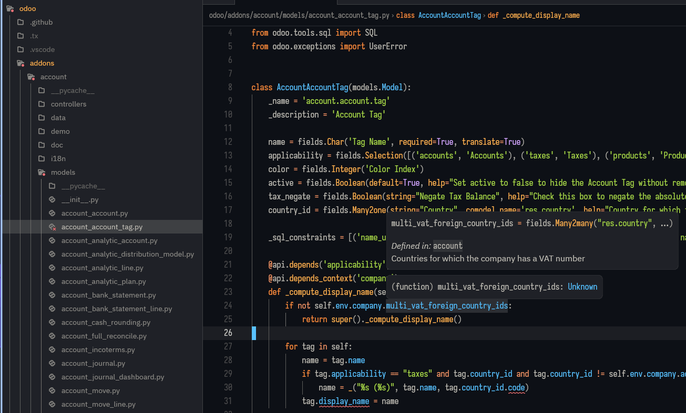

# odoo-lsp for Zed

An extension for the [Zed] editor.

## Install

Ensure that `cargo` and `rustup` are [installed](https://www.rust-lang.org/tools/install),
then select `Install Dev Extension` in Zed and point to this directory.

[Zed]: https://zed.dev
